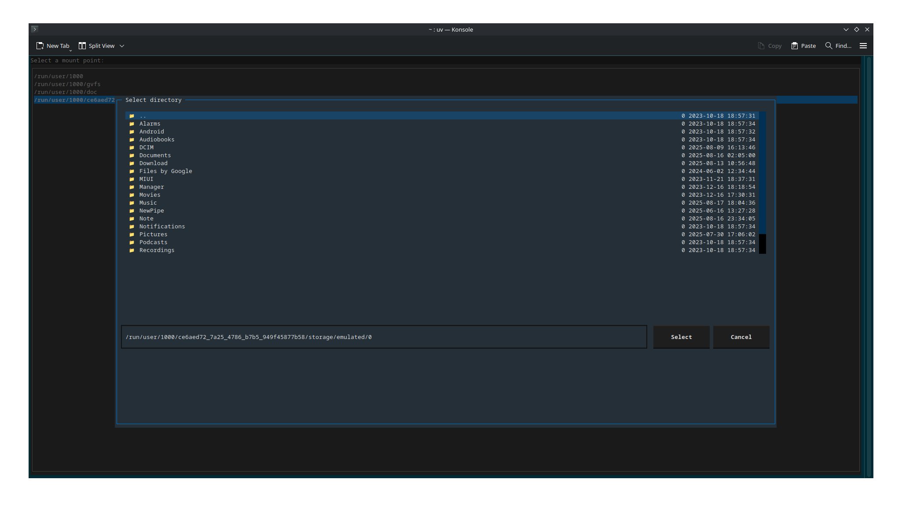

# music2phone

A simple TUI tool to move music from your computer to your phone, designed for users who manage their music collection with [Beets](https://beets.io/).

It allows easily browsing through your artists and albums and selecting which albums you want to add/remove on your phone.
This does not allow moving single songs, the use case is adding and removing full albums with ease.
When you update metadata for an album, you can sync the changes on your phone by removing the album and adding it again.

**Note:** This tool is for a specific use case: your music collection must be managed and synced in the Beets database. It does not scan arbitrary folders for albums; it relies on Beets for music organization.
It assumes all your local music is within one folder and that you wish to move music to one folder on your phone. The file structure on the phone mimics what you have on your computer.
Since this relies on the Beets file structure, any file not registered in your beets database won't be detected. Any file on your phone which is not in the same file structure as on your computer will not be detected.

This tool is made for my own use case: I want an easy way to add albums on my phone to listen on the go. This software makes it easier for me rather than manually going through folders and moving files. That is all it is supposed to do.

## Features

- Sync music from your computer to your phone
- Works with any mount method (KDE Connect, MTP, etc.)
- Simple configuration: just provide the mount location
- Uses your Beets database to identify albums and tracks
- **TUI folder picker**: interactively select your phone's music directory using a terminal UI (powered by [textual-fspicker](https://github.com/davep/textual-fspicker))

## Requirements

- Python 3.8+
- [Beets](https://beets.io/) (your music must be imported and managed with Beets)
- [Textual](https://textual.textualize.io/) (for the TUI folder picker)
- [psutil](https://pypi.org/project/psutil/) (for mount detection)
- [textual-fspicker](https://github.com/davep/textual-fspicker) (for the TUI folder picker)
- Your phone must be mounted (e.g., via KDE Connect, MTP, etc.)

## Installation

```bash
git clone https://github.com/davidoskky/music2phone.git
cd music2phone
uv pip install -e .  # or you can use pip as well
music2phone
```

Alternatively you can use uvx

```bash
uvx git+https://github.com/davidoskky/music2phone
```

## Usage

1. Mount your phone using your preferred method (KDE Connect, MTP, etc.)
2. Run the tool:
3. Select the phone mounting point from the list (select any if not in the list)
4. Use the file picker to select the music folder on your phone
5. Wait for the tool to load, it may take a few seconds
6. Select the albums you want to move to your phone

To move use arrow up and down. Use tab to switch from one tab to the other and enter to sync/unsync an album.

## Screenshots





## License

MIT License (see LICENSE file)
